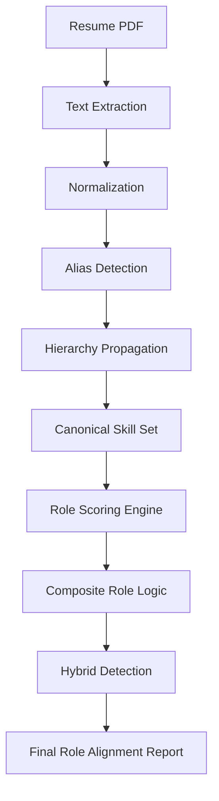
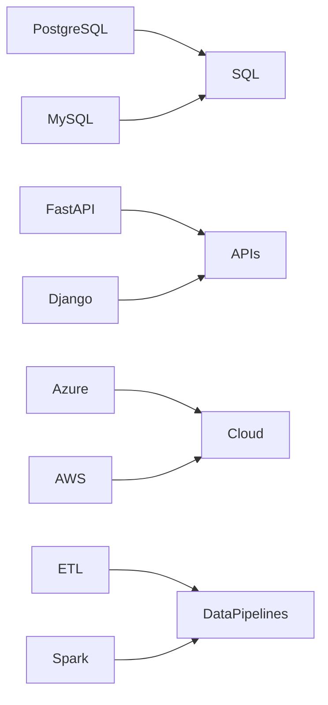
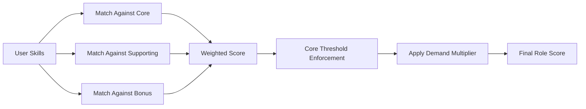
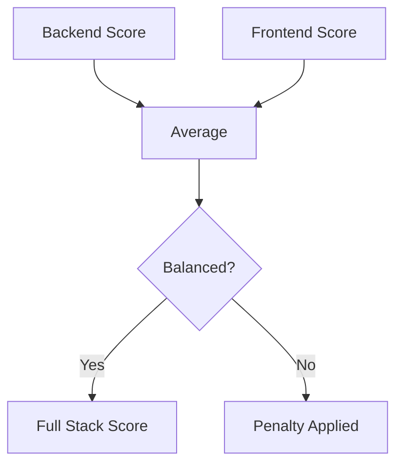

# 🚀 FitStack

A deterministic, ontology-driven role alignment engine that analyzes a resume and identifies which technical roles best match a candidate’s skills.

Built to solve a common problem:

> Many developers know their skills — but don’t know which roles they truly align with.

This project provides structured role scoring instead of black-box AI guessing.

---

## 🔍 What It Does

* Accepts Resume (PDF)
* Extracts canonical technical skills
* Applies skill alias detection
* Propagates skills through a hierarchy graph
* Scores roles using weighted deterministic logic
* Identifies:

  * Best Fit Role
  * Hybrid Profiles
  * Skill Gaps
  * Improvement Suggestions

---

## 🧠 Core Architecture

### High-Level Flow



---

## 🧩 Skill Ontology Layer

Skills are not tied to roles directly.

They exist independently in a structured ontology:



This allows:

* Abstraction
* Skill propagation
* Future semantic expansion
* Expandable role modeling

---

## 🎯 Role Scoring Model

Each role consists of:

* Core Skills
* Supporting Skills
* Bonus Skills
* Demand Multiplier

Scoring Logic:



Core enforcement ensures:

* Weak fundamentals cannot inflate scores.

---

## 🔀 Composite Role Logic

Example: Full Stack Developer

Computed as:



Hybrid detection activates when two top roles are within ±5%.

---

## 🏗️ Tech Stack

Backend:

* FastAPI
* Pydantic
* Uvicorn
* PyMuPDF

Architecture:

* Deterministic skill ontology
* Weighted scoring engine
* Expandable role framework

No LLM dependency.
No external API quota.
Fully transparent logic.

---

## 📦 Installation

```bash
git clone <repo-url>
cd backend
pip install -r requirements.txt
uvicorn main:app --reload
```

Open:

```
http://127.0.0.1:8000
```

---

## 📊 Example Output

```json
{
  "best_fit": "Backend Developer",
  "roles": [
    {
      "role": "Backend Developer",
      "score": 78,
      "matched_skills": ["python", "sql", "apis"],
      "missing_skills": ["authentication"],
      "improvement_steps": ["Improve proficiency in authentication"]
    }
  ]
}
```

---

## 🧭 Roadmap

* Expanded role ontology (10+ roles)
* Skill graph visualization
* Semantic similarity layer (embedding-based)
* Career progression modeling
* Admin-editable role framework
* Production deployment

---

## 🤝 Contributing

If you're interested in:

* Skill graph design
* Role modeling
* System architecture
* Frontend UX improvements

Feel free to open an issue or PR.

Let’s make role clarity structured, transparent, and scalable.

---

## 📄 License

MIT License
